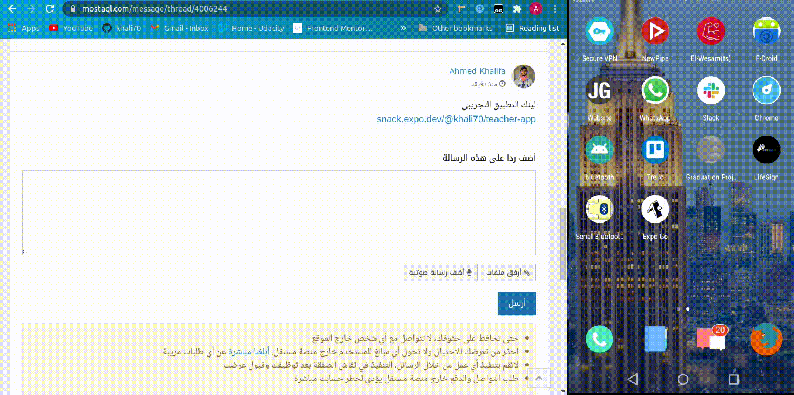

# Teacher-app

the goal of this app is to `display a Database of video courses` here i use youtube

the app display `students comments and important Q&A` about every lesson set by the teacher

> this app is now a demo so `there's no` user `login` or `user`'s and `comments` database for now

**app review**

# how to use the app

